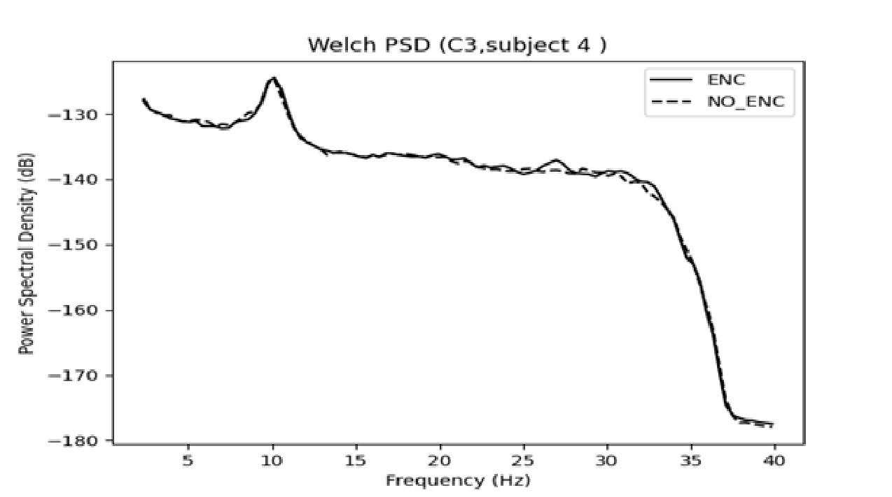
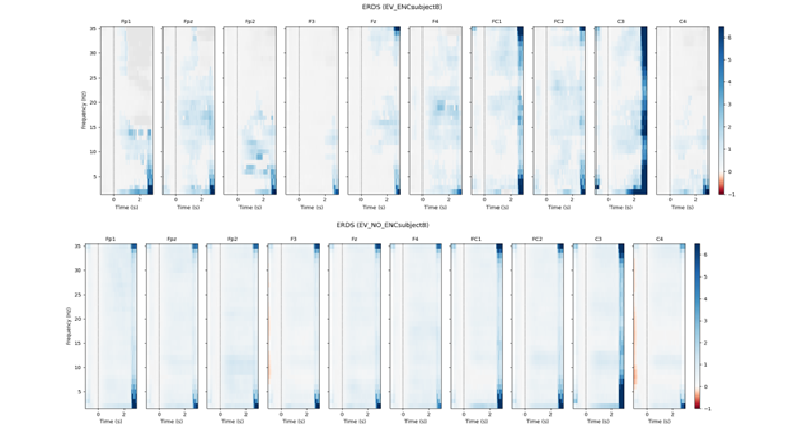
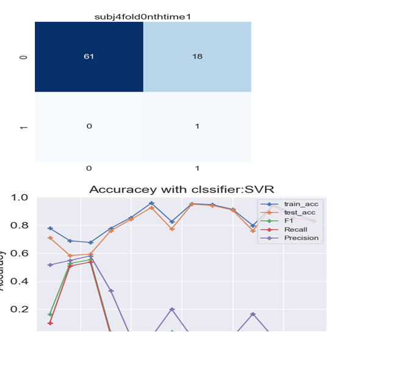
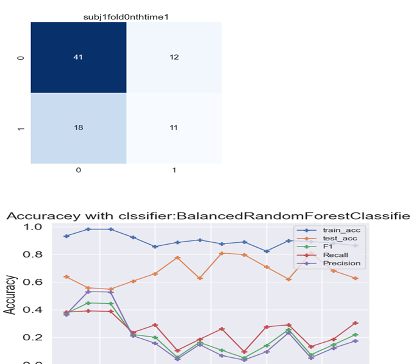
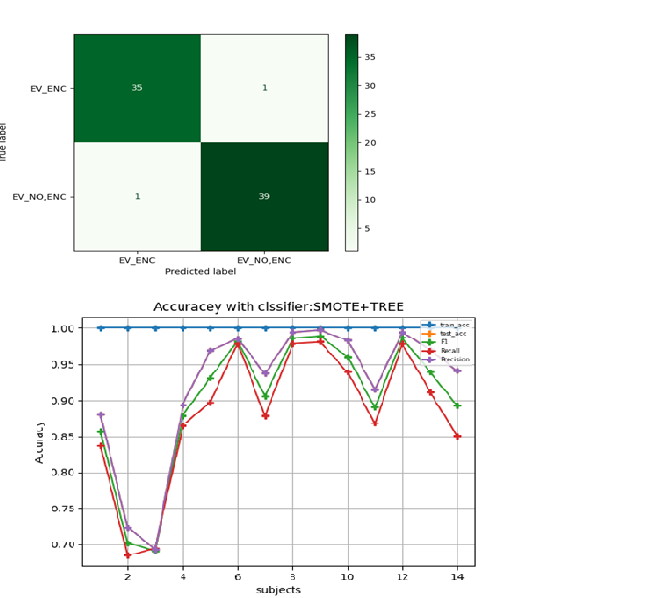

# Filter Bank Common Spatial Patterns (FBCSP) for EEG Signal Processing

Welcome to the repository for Filter Bank Common Spatial Patterns (FBCSP) implementation for EEG signal processing.

## Overview

Filter Bank Common Spatial Patterns (FBCSP) is an extension of the traditional Common Spatial Patterns (CSP) algorithm tailored for Electroencephalography (EEG) signal analysis. FBCSP incorporates a filter bank approach to capture frequency-specific information from EEG signals, enhancing its discriminative power.

## Features

- **Filter Bank Decomposition**: Decompose EEG signals into multiple frequency bands using a filter bank.
- **Spatial Filter Extraction**: Apply CSP independently to each frequency band to extract spatial filters.
- **Feature Concatenation**: Concatenate spatial filters across frequency bands to form feature vectors.
- **Classification**: Train classifiers on the concatenated feature vectors for EEG signal classification.
- **Performance Evaluation**: Evaluate classification performance using cross-validation or other evaluation methods.

## Usage

1. **Preprocessing**: Clean and preprocess EEG data (filtering, artifact removal, etc.).
2. **Filter Bank Decomposition**: Decompose EEG signals into multiple frequency bands.
3. **Spatial Filter Extraction**: Apply CSP independently to each frequency band.
4. **Feature Concatenation**: Concatenate spatial filters to form feature vectors.
5. **Classification**: Train classifiers on feature vectors for EEG signal classification.
6. **Evaluation**: Evaluate classifier performance using appropriate metrics.

## Implementation

This implementation is available in Python and MATLAB, utilizing common signal processing libraries and tools. Refer to the provided scripts and documentation for detailed usage instructions.

## References

- [Original CSP Paper](link_to_original_paper)
- [Related Publications](link_to_related_publications)
- [EEG Signal Processing Resources](link_to_resources)

## Contributing

Contributions are welcome! If you have improvements or suggestions, feel free to open an issue or submit a pull request.

## License

This project is licensed under the [MIT License](LICENSE).

# Data Analysis
We have used t  following visualization for data analysis
## 1.	PSD plots of each subject

 
 Observation: prominent activity across all subjects for both classes (ENC, NO_ENC) in 5 -20 Hz   and 25- 35 Hz  
2.	visualization PSDs of delta theta alpha beta for each subject(many graphs)
   Observation:  No fixed pattern found, activity in different bands for different subject
3.	Top maps of delta theta alpha beta bands for each object to see activity   neural across 

 
observation:  No fixed pattern was found; however, we can use these maps and PSD plots to reduce the number of channels for analysis.
4.	 ERD/S MAP  analysis  ERD/S calculation for both Classes (ERD ENC vs ERD NO ENC)
 
  

 
Observation alpha band seems to have a pattern however EERD is affected by extreme values in epochs which can be seen in can be solved by reject epochs which can result in data loss.
 
 ## Classification for each of 14 subjects
Classification:  Based on database result 2,3,4 we have chosen FBCSP  because it has the ability to estimate subject-specific bands  spatial filters  to increase inter-class variance 
## 1.	Results using SVM with RBF kernel
Highly affected by class imbalance   extremely low F1 precision and Recall scores
 
 

## 2.	Results using balanced random forest tress n=15 tress 
 make class priors equal, by down-sampling or upsampling. Hence, BRF does this by iteratively drawing a bootstrap sample with equal proportions of data points from both the minority and the majority classes. Test accuracy has decreased however better F1 precision and Recall scores  as compared to SVM
 
 

## 3.	Results using Synthetic Minority Oversampling SMOTE+ standard random forest tress n=150 tress 
SMOTE (Synthetic Minority Oversampling Technique) is an oversampling technique that uses a minority class to generate synthetic samples. In consequence, it overcomes the overfitting problem raised by random oversampling. SMOTE works by generating instances that are close in feature space, using interpolation between positive cases that are close to each other. It randomly selects a minority class instance and finds its nearest neighbor. Then it creates synthetic models by randomly choosing one of the neighbors and forms a line segment in the feature space. It then generates synthetic instances of the two selected instances as convex combinations. It is time to see SMOTE in action using SRF. So far  these are the best result produced by SMOTE
 
 

